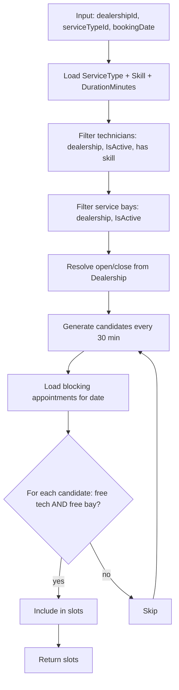

# Phase 4 — Appointment Booking Plan

**Status:** Approved design (pending implementation)  
**Last updated:** 2026-06-17  
**Related:** [IMPLEMENTATION_PLAN.md](./IMPLEMENTATION_PLAN.md), [relationship-map.md](./relationship-map.md), [AGENTS.md](../AGENTS.md)

---

## Scope

Full Phase 4 delivery:

- `GET /api/availability` — slot discovery
- `POST /api/appointments` — booking with conflict prevention
- `GET /api/appointments/{id}` — appointment detail
- `GET /api/customers/{id}/appointments` — customer history
- `GET /api/dealerships/{id}/appointments?date=` — daily staff schedule

**Prerequisite:** Phase 3 CRUD complete (technicians, bays, service types, skills, customers, vehicles manageable via API).

---

## Design decisions

| Topic | Decision |
|-------|----------|
| Display model | **Bay-agnostic** — availability returns time slots only; no `technicianId` or `serviceBayId` in the response |
| Business hours | Fixed **dealership hours** stored on `Dealership` (not `AvailabilityRule` / `AvailabilityOverride` entities) |
| Slot step | **30 minutes** (`1800` seconds) |
| Date/time model | `bookingDate` = UTC calendar date (midnight); `secondsFromMidnight` for start time |
| Blocking statuses | `Scheduled` and `InProgress` block capacity |
| Cancelled status | **Deferred** — no cancel API or `Cancelled` transitions in Phase 4 |
| No capacity | `200 OK` with `slots: []` |
| Past closing | Reject slot if `secondsFromMidnight + durationSeconds > closeSecondsFromMidnight` |
| Concurrency | **Optimistic** conflict check at `POST` → `409 Conflict` on double-book; enhance later |
| Availability auth | Any **authenticated** user (`[Authorize]`, no specific permission policy) |
| Booking auth | `appointments:write` for create; `appointments:read` for staff list/detail |
| `appointments:read:own` | Deferred until `User` ↔ `Customer` link exists |
| Active resources | Only `IsActive` technicians, bays, and service types; technicians must have required skill |
| Past slots | Exclude slots on the requested date where `secondsFromMidnight` is in the past (UTC) |
| Deferred entities | `AvailabilityRule` / `AvailabilityOverride` — document only; see [relationship-map.md](./relationship-map.md) |

---

## Data model changes

### Dealership — business hours

Add two integer fields (seconds from UTC midnight):

| Field | Example | Meaning |
|-------|---------|---------|
| `OpenSecondsFromMidnight` | `28800` | 08:00 |
| `CloseSecondsFromMidnight` | `61200` | 17:00 |

**Validation:**

- `0 <= open < close <= 86400`
- Recommend aligning both to 30-minute steps

**Follow-on:** Extend `CreateDealershipRequest`, `UpdateDealershipRequest`, `DealershipResponse`, and `DealershipService` validation. Migration should set sensible defaults for existing rows (e.g. 08:00–17:00).

### Appointment — align entity with database

| Column | Action |
|--------|--------|
| `VehicleId` | Add to C# entity (FK already exists in DB) |
| `Status` | Add column, `NOT NULL`, default `Scheduled` (store as `int` matching enum) |
| `StartTime`, `EndTime` | **Replace** with `BookingDate` + `SecondsFromMidnight` |
| End time | **Not stored** — computed as `secondsFromMidnight + serviceType.DurationMinutes * 60` |

Add `AppointmentConfiguration.cs` for FKs and indexes.

Fix `Appointment` entity access (current private setters block EF/service persistence).

### Overlap logic

For appointments on the same `bookingDate` with blocking statuses (`Scheduled`, `InProgress`):

```
endSeconds = secondsFromMidnight + (durationMinutes * 60)

Two intervals overlap when:
  startA < endB AND endA > startB
```

---

## Availability algorithm

```
Input:  dealershipId, serviceTypeId, bookingDate (UTC date)

1. Load service type (active, belongs to dealership) → skillId, durationMinutes
2. Load dealership → openSeconds, closeSeconds
3. Qualified technicians = same dealership, IsActive, has required skill via TechnicianSkill
4. Active bays = same dealership, IsActive
5. Load appointments for bookingDate where Status ∈ {Scheduled, InProgress}
   (for those technicians and bays)
6. For each candidate start S from openSeconds to closeSeconds - duration,
   stepping by 1800 seconds (30 min):
     - Reject if S + duration > closeSeconds
     - Reject if bookingDate is today (UTC) and S is in the past
     - Slot is available iff ∃ qualified technician T AND ∃ bay B
       with no overlapping appointment on T or B
7. Return { bookingDate, serviceTypeId, durationMinutes, slots }
```

**Important:** The UI is bay/technician-agnostic, but the engine still requires **both** a free qualified technician and a free bay (conjunctive check, hidden from the client).

---

## API surface

### `GET /api/availability`

| Query param | Type | Notes |
|-------------|------|-------|
| `dealershipId` | `guid` | Required |
| `serviceTypeId` | `guid` | Required |
| `date` | `YYYY-MM-DD` | UTC calendar date |

- **Auth:** `[Authorize]` — any authenticated user
- **Errors:** `404` if dealership or service type missing, or service type not at dealership; `400` for invalid date

**Response example:**

```json
{
  "bookingDate": "2026-06-17",
  "serviceTypeId": "3fa85f64-5717-4562-b3fc-2c963f66afa6",
  "durationMinutes": 60,
  "slots": [
    { "secondsFromMidnight": 28800 },
    { "secondsFromMidnight": 30600 }
  ]
}
```

### `POST /api/appointments`

- **Auth:** `appointments:write`
- **Body:** `customerId`, `vehicleId`, `serviceTypeId`, `bookingDate`, `secondsFromMidnight` (no technician/bay — server assigns)

**Validations:**

- Customer, vehicle, and service type exist
- Vehicle belongs to customer
- Service type is active and at the correct dealership
- `secondsFromMidnight` on 30-minute grid and within business hours
- Slot still available (re-run availability check for that instant)
- `409 Conflict` if slot taken between check and save

**Server assigns:**

- First free qualified technician (deterministic order, e.g. by id/name)
- First free bay (deterministic order)
- `Status = Scheduled`

### Read endpoints

| Endpoint | Auth |
|----------|------|
| `GET /api/appointments/{id}` | `appointments:read` |
| `GET /api/customers/{id}/appointments` | `appointments:read` |
| `GET /api/dealerships/{id}/appointments?date=` | `appointments:read` |

Responses expose `bookingDate`, `secondsFromMidnight`, `durationMinutes` (from service type), assigned `technicianId`, `serviceBayId`, `status`, and related ids.

**Request example:**

```json
{
  "customerId": "3fa85f64-5717-4562-b3fc-2c963f66afa6",
  "vehicleId": "3fa85f64-5717-4562-b3fc-2c963f66afa6",
  "serviceTypeId": "3fa85f64-5717-4562-b3fc-2c963f66afa6",
  "bookingDate": "2026-06-17",
  "secondsFromMidnight": 28800
}
```

---

## Implementation steps

1. **Schema and entities**
   - Extend `Dealership` with `OpenSecondsFromMidnight` / `CloseSecondsFromMidnight`; migration with defaults
   - Refactor `Appointment` entity + add `AppointmentConfiguration`
   - Migration: `Status`, replace `StartTime`/`EndTime` with `BookingDate` + `SecondsFromMidnight`, wire `VehicleId`
   - Update Dealership DTOs, service, and tests for business hours

2. **Pure availability engine** (`AvailabilityEngine.cs` or static helper)
   - Slot generation, overlap check, conjunctive technician + bay availability
   - No EF dependency — accepts in-memory data structures for unit testing

3. **`IAvailabilityService` + `AvailabilityService`**
   - Load data from EF, delegate to engine, map to DTOs

4. **`IAppointmentService` + `AppointmentService`**
   - `CreateAsync` with conflict re-check and auto-assign
   - `GetByIdAsync`, `GetByCustomerAsync`, `GetByDealershipAndDateAsync`

5. **Controllers**
   - `AvailabilityController` — `GET /api/availability`
   - `AppointmentController` — create and read actions
   - Register services in `Program.cs`

6. **Tests**
   - `AvailabilityEngineTests` — slots, overlap, close boundary, no qualified techs, conjunctive bay + tech
   - `AppointmentServiceTests` — happy path, `409` on conflict, invalid slot
   - Controller tests following the Dealership pattern

7. **Docs and smoke tests**
   - Update `relationship-map.md` — mark `AvailabilityRule` / `AvailabilityOverride` as deferred
   - Update `IMPLEMENTATION_PLAN.md` Phase 4 checkboxes and schema notes
   - Add samples to `universal-scheduler-be.http`

---

## Files to touch

| Area | Files |
|------|-------|
| Entities | `Infrastructure/Entities/Dealership.cs`, `Infrastructure/Entities/Appointment.cs` |
| EF | `Infrastructure/Persistence/Configurations/AppointmentConfiguration.cs`, new migration |
| DTOs | `Infrastructure/Dealerships/Dtos/*`, `Infrastructure/Appointments/Dtos/*` (new) |
| Services | `AvailabilityEngine.cs`, `IAvailabilityService.cs`, `AvailabilityService.cs`, `IAppointmentService.cs`, `AppointmentService.cs`, `DealershipService.cs` |
| HTTP | `Controllers/AvailabilityController.cs`, `Controllers/AppointmentController.cs`, `Program.cs` |
| Tests | `AvailabilityEngineTests.cs`, `AppointmentServiceTests.cs`, controller tests, `DealershipServiceTests` updates |
| Docs | `relationship-map.md`, `IMPLEMENTATION_PLAN.md`, `universal-scheduler-be.http` |

---

## Edge cases

| Case | Handling |
|------|----------|
| No qualified technician | `200 OK`, `slots: []` |
| All bays busy | `200 OK`, `slots: []` |
| Service spans past close | Slot not generated / `400` on POST |
| Double booking | Re-check before insert → `409 Conflict` |
| Inactive technician/bay/service type | Excluded from availability and assignment |
| Cancelled appointments | Not implemented in Phase 4; only `Scheduled` bookings exist initially |

---

## Deferred to later phases

| Item | Phase |
|------|-------|
| `PATCH` status transitions | Phase 5 |
| `POST` cancel with reason | Phase 5 |
| `Cancelled` status freeing slots | Phase 5 |
| `AvailabilityRule` / `AvailabilityOverride` per-technician schedules | Post–Phase 4 |
| `appointments:read:own` customer scoping | When `User` ↔ `Customer` link exists |
| DB-level locking / serializable transactions | Future enhancement |
| FluentValidation for DTOs | Phase 6 |

---

## Algorithm flow (reference)


