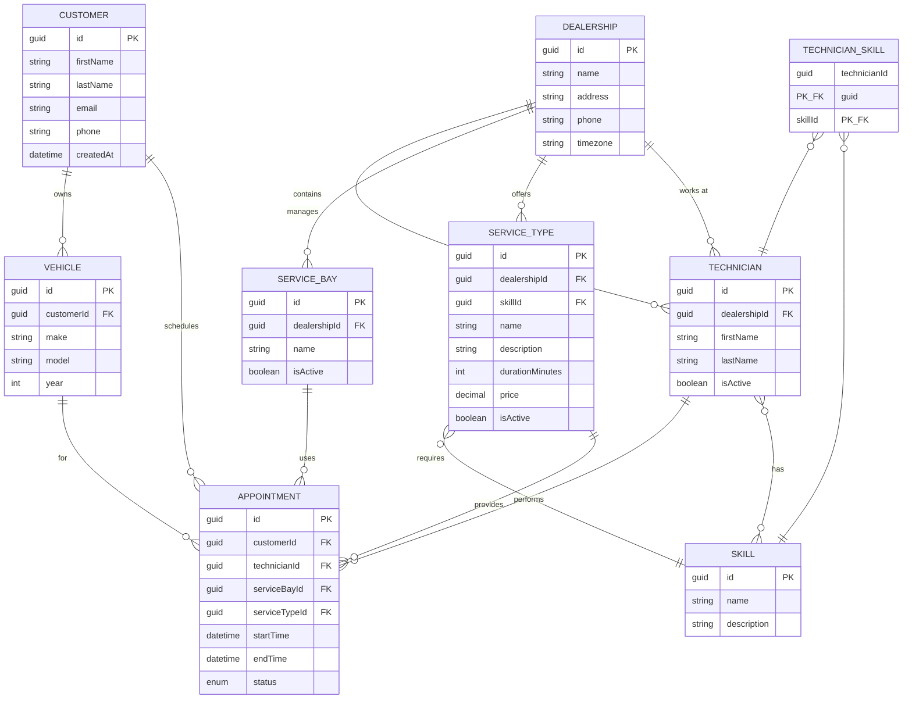
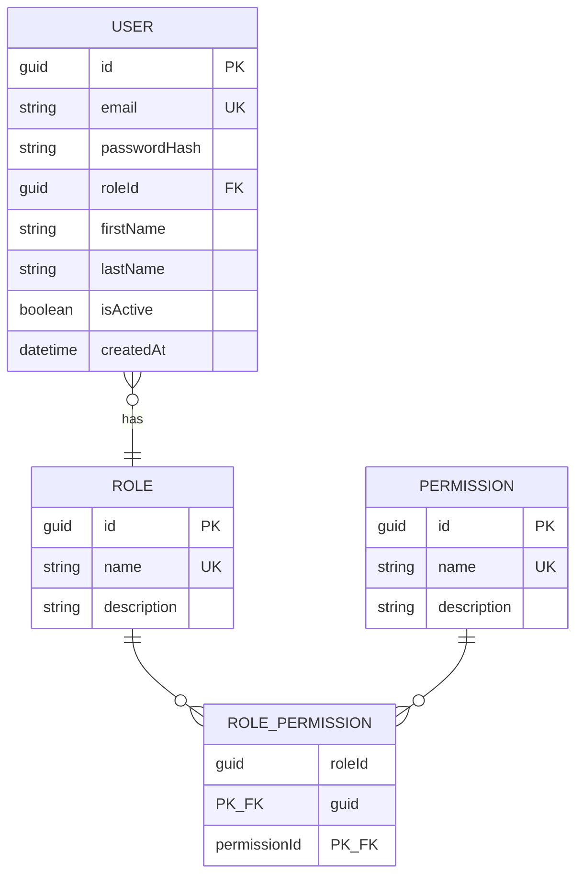

# Entity Relationship Diagram

## Entity Descriptions

### Core Entities

**Dealership**
- Central hub for all operations
- Contains multiple technicians, service bays, and service types
- Stores timezone information for scheduling

**Technician**
- Works at a specific dealership
- Has multiple skills through the TechnicianSkill junction table
- Can have multiple appointments

**Customer**
- Owns vehicles
- Can schedule multiple appointments

**Vehicle**
- Belongs to a customer
- Can have multiple appointments for different services

### Service Management

**Skill**
- Represents a required capability (e.g., "Oil Change", "Engine Diagnostics")
- Many-to-many relationship with technicians via TechnicianSkill
- Required for specific service types

**ServiceType**
- Specific service offered by dealership
- Requires a specific skill
- Has pricing and duration information

**ServiceBay**
- Physical location where appointments are performed
- Belongs to a specific dealership
- Can have multiple appointments

### Operational Entity

**Appointment**
- Links customer, vehicle, technician, service bay, and service type
- Has start/end times
- Can be in states: Scheduled, InProgress, Completed, Cancelled

**TechnicianSkill** (Junction Table)
- Many-to-many relationship between technician and skill
- Allows tracking which skills each technician possesses

## Authentication

Authentication is separate from scheduling (`CUSTOMER` has no FK to auth `USER`).

### Authentication entities

**User**
- Login account for the application API
- Not linked to `Customer` in the current schema
- Each user has exactly one `Role` via `RoleId`

**Role**
- Named access level (`Admin`, `Staff`, `User`)
- Many-to-many with permissions through `RolePermission`

**Permission**
- String claim name used for authorization (e.g. `appointments:read:own`)
- Seeded in [`AuthSeedData.cs`](../Infrastructure/Persistence/AuthSeedData.cs)

**RolePermission** (Junction Table)
- Many-to-many relationship between role and permission

### Seed data (authentication)

Default roles and permissions are seeded via EF Core `HasData` in the `AddAuthentication` migration.

| Role | Permissions |
|------|-------------|
| Admin | `appointments:read`, `appointments:read:own`, `appointments:write`, `users:manage` |
| Staff | `appointments:read`, `appointments:write` |
| User | `appointments:read:own`, `appointments:write` |

`appointments:read:own` is enforced in application code when JWT/endpoints are added (e.g. filter appointments by a future `User` ↔ `Customer` link). The database stores only the permission name.
